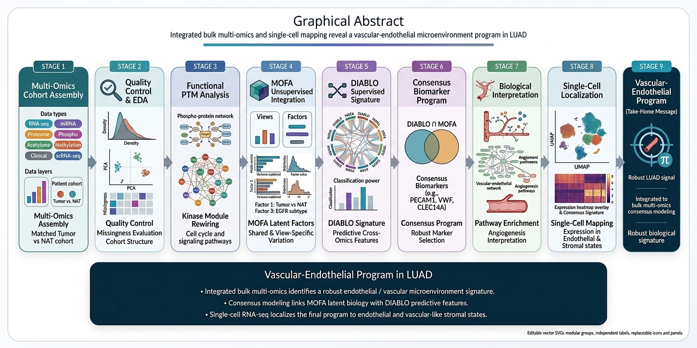

# MODA: Integrative Multi-Omics Analysis of LUAD with Consensus Bulk-to-Single-Cell Interpretation

Public-facing multi-omics LUAD workflow integrating matched bulk omics, latent factor modeling, supervised multi-block learning, consensus signatures, and single-cell localization.

---

## Project overview figure

<p align="center">
  
</p>

---

## Interactive results report

A browser-viewable HTML report summarizing the main analysis outputs and selected final results is available here:

**[Open MODA Results Report](https://zizo54619.github.io/LUAD-MultiOmics-SingleCell/docs/MODA_Results.html)**


---

## At a glance

- **Disease context:** Lung adenocarcinoma (LUAD)
- **Core cohort:** 369 matched samples
- **Tumor samples:** 186
- **NAT samples:** 183
- **Omics layers:** RNA-seq, miRNA, proteome, phosphoproteome, acetylome, methylation
- **Main methods:** MOFA+, DIABLO, consensus intersection, Reactome enrichment, and scRNA-seq localization
- **Main finding:** the strongest reproducible signal in the current public workflow is a **vascular/endothelial-associated microenvironmental program**

---

## What to look at first

If you are visiting this repository for the first time, start here:

- [Interactive results report](https://zizo54619.github.io/LUAD-MultiOmics-SingleCell/docs/MODA_Results.html)
- [Key results](#key-results)
- [Data availability and public/private boundaries](#what-is-public-vs-private)
- [How to run the workflow](#reproducibility--how-to-run)

---

## Why this project matters

Lung adenocarcinoma (LUAD) is biologically heterogeneous across molecular, clinical, and microenvironmental axes.  
This project was designed to identify **robust biological programs that remain consistent across complementary multi-omics integration strategies**, then localize the dominant signal within single-cell RNA-seq data.

Rather than presenting a single model in isolation, this repository combines:

- matched bulk multi-omics integration
- latent factor analysis
- supervised signature discovery
- consensus overlap analysis
- single-cell interpretation

The goal is not to claim a clinically validated biomarker, but to present a **transparent, reproducible, and biologically interpretable research workflow**.

---

## Dataset / data source

This repository is a **curated public packaging** of a larger notebook-driven LUAD analysis workspace.

### Cohort summary

- **Matched all-layer cohort:** 369 samples
- **Tumor:** 186
- **Normal adjacent tissue (NAT):** 183

### Core omics layers

- RNA-seq
- miRNA
- proteome
- phosphoproteome
- acetylome
- methylation

### Additional context

Clinical annotations in the original workspace include genotype, subtype, immune labels, stage-related variables, and survival-related fields.

---

## What is public vs private

This section is especially important for reproducibility and scientific transparency.

### Public in this repository

- canonical workflow notebooks
- helper scripts
- environment scaffolding
- selected public-facing figures
- summary tables
- final signature files
- documentation describing external dependencies

### Not redistributed here

- raw CPTAC/ICPC omics files
- processed patient-level matrices
- raw clinical sample-level tables
- full trained MOFA and DIABLO model binaries
- Seurat objects or full cell-level matrices

This repository should therefore be interpreted as a **public analysis package and documentation layer**, not a full unrestricted data release.

---

## Methods / workflow

The public workflow is organized as a staged analysis:

1. **Import and sample harmonization**  
   Align matched samples across omics layers and prepare the analysis-ready cohort.

2. **QC, normalization, and batch-aware preprocessing**  
   Perform filtering, missingness handling, imputation, batch correction, and scaling.

3. **Clinical metadata curation**  
   Standardize and derive labels for downstream interpretation.

4. **Single-omics baseline analysis**  
   Establish tumor-versus-NAT biology and pathway-level context.

5. **MOFA+ integration**  
   Learn latent multi-omics structure and extract factor-associated features.

6. **DIABLO supervised integration**  
   Build cross-omics signatures using supervised multi-block learning.

7. **Consensus intersection and enrichment**  
   Intersect MOFA and DIABLO outputs and characterize the shared signature using enrichment analysis.

8. **Single-cell localization**  
   Score the final intersected signature in scRNA-seq data to identify the dominant cellular context.

---

## Repository structure

```text
LUAD-MultiOmics-SingleCell/
├─ workflow/                  # Canonical analysis notebooks and run_all.R
├─ R/                         # Shared helper functions and path utilities
├─ config/                    # Example runtime path configuration
├─ env/                       # R and Python environment scaffolding
├─ data/                      # Data-access documentation and non-sensitive manifests
├─ results/                   # Public-facing figures, summary tables, signatures
├─ docs/                      # Graphical abstract and presentation assets
├─ README.md
├─ LICENSE
├─ CITATION.cff
└─ CONTRIBUTING.md
